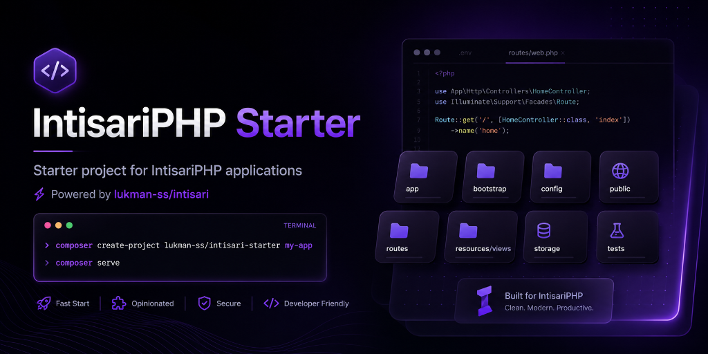

# IntisariPHP Starter



Starter project for building PHP applications with [IntisariPHP core](https://packagist.org/packages/lukman-ss/intisari).

## Requirements

- PHP >= 8.2
- Composer

## Quick Start

```bash
composer create-project lukman-ss/intisari-starter my-app
cd my-app
cp .env.example .env
```

## Development Server

Start the built-in PHP development server:

```bash
composer serve
```

The application will be available at [http://127.0.0.1:8000](http://127.0.0.1:8000).

## Running Tests

```bash
composer test
```

## Documentation

Read the documentation:

- [Documentation Index](docs/index.md)
- [Installation](docs/installation/index.md)
- [Build Your First Application](docs/tutorials/build-your-first-app.md)
- [Deployment](docs/deployment/index.md)

Key folders: `app/`, `config/`, `public/`, `routes/`, `storage/`, `tests/`.

Command line details are documented in [Command Line Usage](docs/cli/index.md).

Available commands include `php intisari serve`, `php intisari route:list`, `php intisari config:cache`, `php intisari config:clear`, `php intisari make:controller UserController`, `php intisari make:middleware AuthMiddleware`, `php intisari make:provider PaymentServiceProvider`, `php intisari make:command SendEmailCommand`, `php intisari about`, `php intisari env`, and `php intisari test`.

## Core Package

This starter project is powered by [`lukman-ss/intisari`](https://packagist.org/packages/lukman-ss/intisari).

## License

MIT
